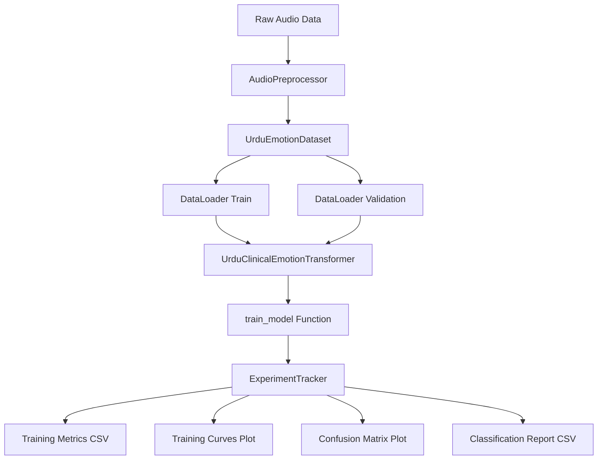

```mermaid
graph TD
    A[Raw Audio Data] --> B[AudioPreprocessor]
    B --> C[UrduEmotionDataset]
    C --> D[DataLoader Train]
    C --> E[DataLoader Validation]
    D --> F[UrduClinicalEmotionTransformer]
    E --> F
    F --> G[train_model Function]
    G --> H[ExperimentTracker]
    H --> I[Training Metrics CSV]
    H --> J[Training Curves Plot]
    H --> K[Confusion Matrix Plot]
    H --> L[Classification Report CSV]
```