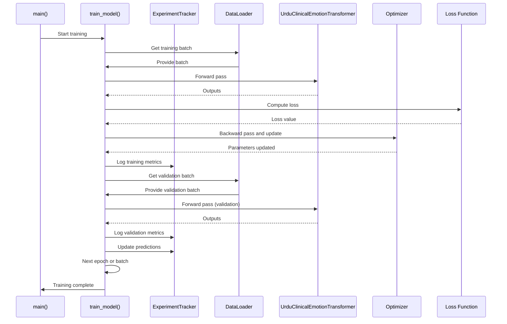

```mermaid
sequenceDiagram
    participant Main as main()
    participant Train as train_model()
    participant Tracker as ExperimentTracker
    participant Loader as DataLoader
    participant Model as UrduClinicalEmotionTransformer
    participant Optimizer as Optimizer
    participant LossFn as Loss Function

    Main->>Train: Start training
    Train->>Loader: Get training batch
    Loader->>Train: Provide batch
    Train->>Model: Forward pass
    Model-->>Train: Outputs
    Train->>LossFn: Compute loss
    LossFn-->>Train: Loss value
    Train->>Optimizer: Backward pass and update
    Optimizer-->>Train: Parameters updated
    Train->>Tracker: Log training metrics
    Train->>Loader: Get validation batch
    Loader->>Train: Provide validation batch
    Train->>Model: Forward pass (validation)
    Model-->>Train: Outputs
    Train->>Tracker: Log validation metrics
    Train->>Tracker: Update predictions
    Train->>Train: Next epoch or batch
    Train->>Main: Training complete
```